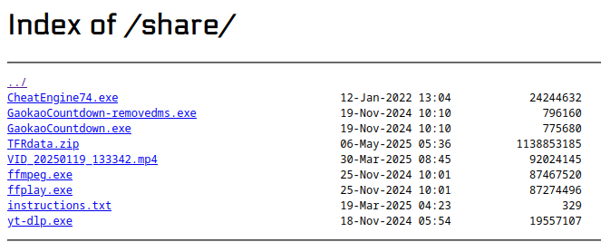
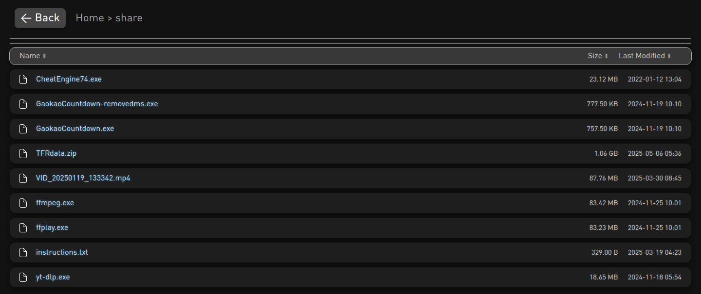

### Better autoindex for Nginx!

JUST SHOW ME HOW BETTER: try out [here](https://997779.xyz/share/)

BEFORE:



AFTER:




TL;DR: How to use

1. add `add_after_body` param under `location`: example:
```
server {...
        location /
		{
			...
			autoindex on;
			autoindex_exact_size on;
			autoindex_localtime on;
			add_after_body /.autoindex.html;
		}
	}
```
`autoindex_exact_size` must be on since customized file size display relies on that! (but its by default on anyways..)

`autoindex_localtime` is optional

2. delete `delthis` in two filenames, and put them under the root dir of your file share

3. (optional) 
    - you can absolutely put the .autoindex.html anywhere as long as its part of the shared file tree
    - you can also use another font or just no font, whatever

### Functionalities:
1. dark mode
2. auto size for columns
3. fixed default filename truncating
4. changed icons to white to adapt dark mode
5. added file sorting (folders priority)
6. better parent folder navigation
7. better path breadcrumb
8. FANCY UI! (round corners, float, animations, shadows, fonts, etc.)

### Credits

got idea [here](https://github.com/tucke/nginx-autoindex)

after knowing this could be customized and i was like: wtf guys, hasnt this got its r/autoindexporn? 